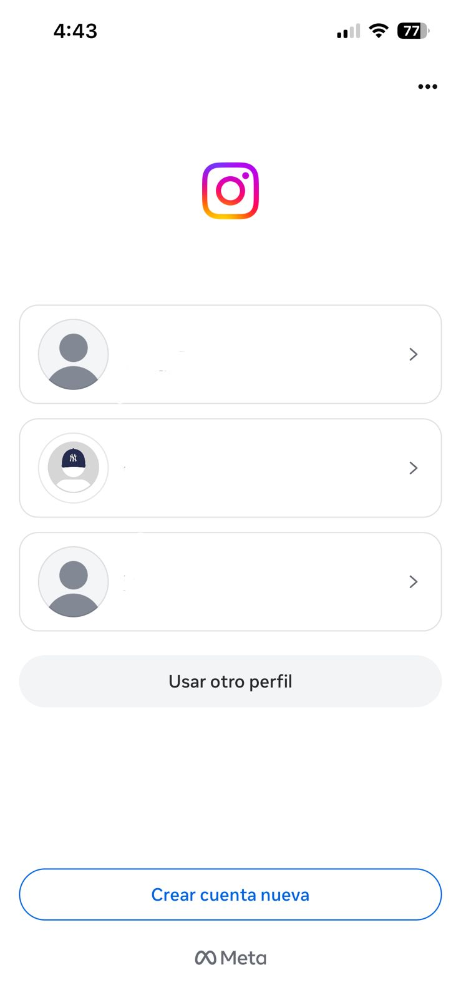

# Auditoría Heurística — Instagram (iOS)

**Estudiante:** Johan Carreño
**Asignatura:** Aplicaciones Móviles
**Plataforma evaluada:** iOS
**Versión de la app:** Instagram Versión 421.1.0

## Descripción del proyecto

Este repositorio contiene la auditoría heurística de usabilidad de Instagram (iOS),
realizada aplicando las 10 heurísticas de Nielsen sobre 3 flujos críticos de usuario.

## Flujos auditados

### Flujo A: Registro y Onboarding
**Justificación:** Es el primer contacto del usuario con la app.
Errores aquí generan abandono inmediato y pérdida permanente del usuario.

### Flujo B: Búsqueda y exploración de contenido (pestaña Explorar)
**Justificación:** Es el flujo de mayor uso recurrente. La mayoría de
sesiones incluyen esta función, por lo que fallas aquí afectan directamente
la retención y satisfacción del usuario.

### Flujo C: Publicación de una historia (Story)
**Justificación:** Es una función diferenciadora clave de Instagram. Su
complejidad en opciones de edición la hace propensa a problemas de usabilidad
que frustran a usuarios intermedios y avanzados.

## Estructura del repositorio
Carreño-post1-u2/
├── README.md                  # Este archivo
├── checklist_heuristico.md    # Tabla de hallazgos heurísticos
├── reporte_auditoria.md       # Reporte final estructurado
└── evidencias/                # Capturas de pantalla de Instagram

## Captura pantalla principal

